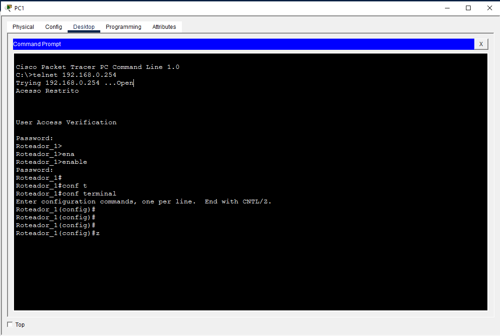

# Lab 01 - Configurações Iniciais 
Este laboratório aborda a configuração básica de segurança e conectividade inicial em um roteador Cisco.

## Topologia do Laboratório

## Configurações Aplicadas
As configurações completas do roteador e do switch podem ser encontradas nos arquivos `CLI_roteador.cfg` e `SW1_switch.cfg` nesta mesma pasta.

---

## Testes e Validação do Acesso Remoto
Para garantir que as configurações de segurança (senhas, banner e linhas VTY) foram aplicadas corretamente, foi realizado um teste de acesso remoto via **Telnet** acessando o cmd a partir do PC1 para o IP do roteador (`192.168.0.254`).

### Resultado do Teste:
A imagem abaixo mostra o passo a passo da simulação do acesso remoto

