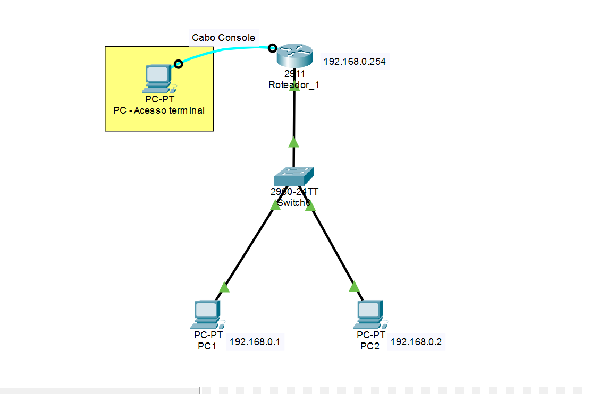

# Lab 01 - Configurações Iniciais de Dispositivos Cisco

Este laboratório aborda a configuração básica de segurança e conectividade inicial em um roteador Cisco.

## Topologia do Laboratório

## Configurações Aplicadas
As configurações completas do roteador e do switch podem ser encontradas nos arquivos `R1_router.cfg` e `SW1_switch.cfg` nesta mesma pasta.

---

## 🧪 Testes e Validação do Acesso Remoto

Para garantir que as configurações de segurança (senhas, banner e linhas VTY) foram aplicadas corretamente, foi realizado um teste de acesso remoto via **Telnet** a partir de um PC da rede para o IP do roteador (`192.168.0.254`).

### Resultado do Teste:
O acesso foi estabelecido com sucesso, exigindo a senha configurada antes de liberar a CLI:

1. **Mensagem de Boas-vindas:** O Banner MOTD (`Acesso Restrito`) foi exibido imediatamente após a conexão.
2. **Autenticação:** O roteador barrou o acesso no modo usuário e no modo privilegiado (`enable`), solicitando as senhas definidas em laboratório.

*(Opcional: Você pode colocar um print dessa tela preta aqui usando a tag abaixo se salvar a imagem na pasta)*
